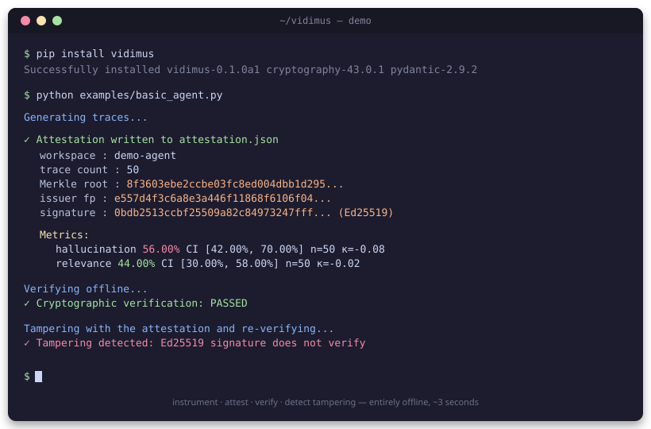

<div align="center">

# Vidimus

### The trust layer for agentic AI

*Verifiable, auditable, cryptographically attested LLM and agent behavior for safety-critical, industrial, and research deployments where AI decisions must be reviewable after the fact.*

[](https://github.com/kabNath/vidimus/releases)
[](https://www.python.org/downloads/)
[](LICENSE)
[](https://github.com/kabNath/vidimus/actions)
[](#run-with-docker)

[Quickstart](docs/quickstart.md) • [Architecture](ARCHITECTURE.md) • [Roadmap](ROADMAP.md)

</div>

<p align="center">
  
</p>

---

> **vidimus** *(Latin, "we have seen")* — the medieval legal formula used by a scribe or notary to certify that an original document had been personally examined before producing an attested copy. The seal on the bottom said: this is true, and here is the proof.

## Why Vidimus exists

Modern LLM observability tools tell you *what* your agent did. None of them prove it.

When a compliance officer asks "can you guarantee this evaluation report wasn't tampered with after the fact?", the answer is no. When a regulator asks "what's the confidence interval on that hallucination score?", the answer is silence. When a customer asks "can I verify this audit independently, without trusting your vendor?", the answer is "trust us."

Vidimus closes those gaps with three primitives the existing stack lacks:

1. **Tamper-evident traces** every agent interaction hashed and chained in a Merkle tree, so any post-hoc modification is detectable.
2. **Calibrated uncertainty** every evaluation metric ships with a bootstrap confidence interval and multi-judge agreement score, not a point estimate dressed up as truth.
3. **Cryptographic attestations** Ed25519-signed evaluation reports, optionally anchored on-chain (BNB Chain, Ethereum, or any EVM), verifiable offline by any third party.

Drop it in next to your existing observability tool in three lines, or run it standalone.

## Quick start

```bash
pip install vidimus
```

```python
import vidimus

vidimus.init(workspace="acme-prod")

@vidimus.audit
def my_agent(query: str) -> str:
    # your existing agent code
    return llm.invoke(query)
```

Generate a signed attestation over the last 24 hours of traces:

```bash
vidimus attest --since 24h --output report.json
```

Anyone in the world can now verify it offline, without contacting your server:

```bash
vidimus verify report.json
# ✓ Merkle root matches 4,318 traces
# ✓ Ed25519 signature valid (key: vidimus-ai/acme-prod)
# ✓ Hallucination rate: 3.2% [95% CI: 2.7% – 3.8%, n=4,318, k=3 judges, agreement κ=0.82]
# ✓ Optional on-chain anchor: BNB Chain block 47,892,134 (tx: 0xae9f...)
```

That's it. You now have a portable, cryptographically verifiable artifact of your agent's behavior.

### Run with Docker

If you prefer a containerized setup:

```bash
docker build -t vidimus:latest .
docker run --rm vidimus:latest version

# Or with docker compose, with persistent keystore and attestation output:
docker compose run --rm vidimus keys generate
docker compose run --rm vidimus attest --since 24h --output /output/report.json
```

The image is a multi-stage build (~150 MB final), runs as a non-root user, and ships no build tooling in production. See [`Dockerfile`](Dockerfile) and [`docker-compose.yml`](docker-compose.yml).

### Examples

| File | What it demonstrates |
|---|---|
| [`examples/basic_agent.py`](examples/basic_agent.py) | Minimal end-to-end: instrument an agent, attest, verify, detect tampering |
| [`examples/rag_with_vidimus.py`](examples/rag_with_vidimus.py) | Didactic RAG (TF-IDF retriever + stub generator) showing the instrumentation pattern |
| [`examples/rag_production.py`](examples/rag_production.py) | **Production RAG** with sentence-transformers embeddings, FAISS index, and Ollama generator |
| [`examples/opik_integration.py`](examples/opik_integration.py) | Dual decoration (`@opik.track` + `@vidimus.audit`) — Vidimus on top of Comet Opik |
| [`examples/langchain_integration.py`](examples/langchain_integration.py) | LangChain Q&A chain instrumented with Vidimus via OpenTelemetry |


## Architecture

```
                          your application
                                 │
                                 ▼
              ┌──────────────────────────────────┐
              │ @vidimus.audit  or  OTel exporter │
              └─────────────────┬────────────────┘
                                │ (spans, traces)
                                ▼
              ┌──────────────────────────────────┐
              │ vidimus.audit (this module)      │
              │                                  │
              │  • Merkle-chained trace store    │
              │    (DuckDB or ClickHouse)        │
              │  • Multi-judge eval pipeline     │
              │  • Bootstrap CI calibration      │
              │  • Ed25519 signer                │
              │  • Optional EVM anchor           │
              └─────────────────┬────────────────┘
                                │
                                ▼
              ┌──────────────────────────────────┐
              │   signed attestation.json        │
              │   verifiable offline, anywhere   │
              └──────────────────────────────────┘
```

Full technical design in [ARCHITECTURE.md](ARCHITECTURE.md).

## Roadmap

Vidimus will ship in three sequenced modules under one project — a trust stack for the entire agent lifecycle.

| Module | Status | What it provides |
|---|---|---|
| **`vidimus.audit`** (Module A) | 🚧 alpha, this repo | Tamper-evident traces, calibrated uncertainty, cryptographic attestations |
| **`vidimus.optimize`** (Module B) | 🗓 2026 | DRL-based prompt and agent optimization (PPO, MADDPG), with the same audit guarantees applied to the optimization process itself |
| **`vidimus.federate`** (Module C) | 🗓 2027 | Federated evaluation with secure aggregation and differential privacy, for data that cannot leave its environment |

The thesis tying them together: **trustworthy agents that improve over time without compromising privacy.** Each module is independently useful and independently installable.

See [ROADMAP.md](ROADMAP.md) for the detailed plan.

## Use cases

**Regulated industries.** Financial services, healthcare, legal, public sector — anywhere an auditor will eventually ask "prove it." Vidimus produces the artifact.

**High-stakes agent decisions.** When an agent makes a recommendation that affects money, health, or rights, the decision trail should be cryptographically verifiable, not a screenshot.

**Open evaluations and benchmarks.** Researchers and labs can publish signed attestations of their evaluation runs that anyone can verify, removing the "did they cherry-pick?" doubt from leaderboards and papers.

**Investor and customer reporting.** Performance claims backed by signed evaluation artifacts instead of unfalsifiable dashboards.

## Status

Vidimus is in **alpha**. The Python SDK surface may change before v1.0.0. The cryptographic primitives (Ed25519 signatures, SHA-256 Merkle trees, RFC 8785 canonical JSON) are stable and will not break. Production use is at your own risk until v1.0.

We are actively looking for:

- Cryptography review of the attestation format
- Calibration methodology improvements (alternatives to bootstrap CI, better multi-judge aggregation)
- Additional OpenTelemetry exporter integrations
- Translators for docs (French and Mandarin in particular)

## Contributing

See [CONTRIBUTING.md](CONTRIBUTING.md). For substantial contributions, please open a discussion first.

## License

Apache 2.0. See [LICENSE](LICENSE).

## Citation

If you use Vidimus in research, please cite:

```bibtex
@software{vidimus2026,
  author  = {Kaboré, Wendenda Nathanael},
  title   = {Vidimus: A Trust Layer for Agentic AI},
  year    = {2026},
  url     = {https://github.com/kabNath/vidimus},
  license = {Apache-2.0}
}
```

## Related projects

Vidimus is part of a broader research portfolio at the intersection of **AI-native wireless systems** and **trustworthy AI infrastructure**.

### AI-Native Wireless Systems

- **[cuda-phy-channel-estimation](https://github.com/kabNath/cuda-phy-channel-estimation)** GPU-accelerated 5G/6G physical-layer channel estimation in CUDA. Performance benchmarks against reference Python implementations.
- **[sionna-link-adaptation-drl](https://github.com/kabNath/sionna-link-adaptation-drl)** Deep reinforcement learning for link adaptation in 5G/6G, built on NVIDIA Sionna. Beats rule-based AMC baselines on user throughput.
- **[federated-csi-feedback](https://github.com/kabNath/federated-csi-feedback)** Federated learning for CSI feedback compression, preserving user-side privacy while improving overhead across cells.
- **[sagin-maddpg-hfl](https://github.com/kabNath/sagin-maddpg-hfl)** Multi-UAV relay system over Daan District (Taipei) with Starlink backhaul, optimized via MADDPG and Hierarchical Federated Learning.

### Trustworthy AI Infrastructure & Applications

- **Vidimus** *(this repo)* Cryptographic provenance and calibrated uncertainty for LLM evaluation.
- **[AI Capital](https://ai-capital-ir.vercel.app)** — Live algorithmic trading system on QuantConnect. Cross-asset momentum, regime detection, risk parity. First production user of Vidimus attestations.

The unifying thesis: **AI systems that are both performant and accountable, from the wireless physical layer to autonomous agents.**
## Acknowledgments

Vidimus stands on the shoulders of OpenTelemetry, Pydantic, FastAPI, DuckDB, and the broader LLM observability community Opik, Langfuse, LangSmith, OpenLLMetry, Phoenix. The statistical methodology draws on Fleiss (1971), Krippendorff (1970), Efron (1979), and the long line of work on inter-rater reliability that the LLM-as-judge literature has, until now, largely ignored.
